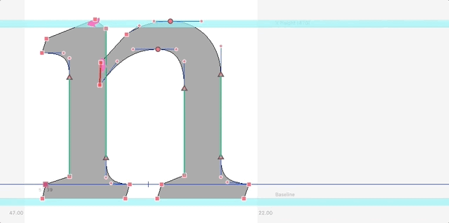

# robofont-angle-checker
A simple tool to define and highlight good and bad angles in Robofont. 

Have some repeating angles to check in your glyph, like slanted serifs or oblique stems? 

With this script, you can set the angle you want, the wiggle room you're willing to accept, and the range of angles to check. This script will then go through all the stokes in your current glyph and highlight the  "bad" and "good" angles in red and teal, so you can spot errors and fix them.
